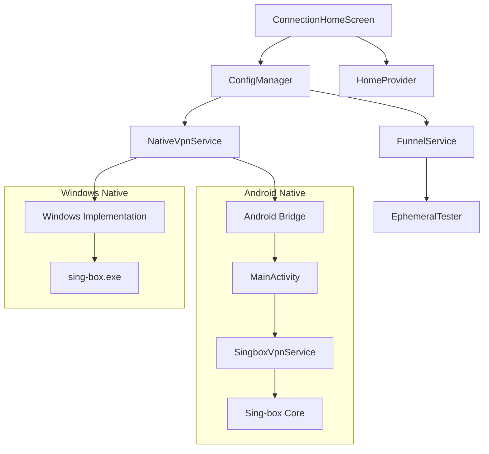

# VPN Architecture Audit & Improvement Blueprint

**Date:** October 26, 2023
**Target:** Production-Grade Flutter VPN Client (Android + Windows)
**Auditor:** Senior Flutter Architect

---

## 1. Executive Summary

This audit reveals a **functional but fragile** VPN client. The application successfully integrates V2Ray/sing-box on both Android and Windows, but suffers from significant architectural tech debt, critical security vulnerabilities, and platform-specific reliability issues.

**Key Strengths:**
*   **Performance:** Excellent use of Dart Isolates (`compute`) for heavy JSON parsing and config generation, preventing UI freezes.
*   **Windows Stability:** Robust (albeit aggressive) process management ensures zombie processes are killed.
*   **Feature Set:** Comprehensive testing suite (TCP/HTTP/Speed), ad integration, and smart routing logic.

**Critical Risks (Must Fix):**
1.  **Security Data Leak:** The Windows implementation logs **full private configurations** (keys, passwords) to the application log in cleartext.
2.  **False Positive Testing (Android):** The "Deep Testing" feature on Android is a facade. It performs a raw TCP handshake to the server port but **does not** verify the proxy protocol (VMess/VLESS), leading to users connecting to "working" servers that are actually blocked or mismatched.
3.  **State Management "Split Brain":** Two competing state systems (`ConfigManager` vs. `HomeProvider`) exist, leading to potential race conditions and maintenance confusion.
4.  **Insecure Storage:** All sensitive credentials are stored in plain text via `SharedPreferences`.

---

## 2. Architecture Overview & System Mapping

### 2.1. High-Level Architecture

The application follows a **Service-Oriented Architecture (SOA)** with a **Provider-based State Management** layer.

*   **UI Layer:** Flutter Widgets (`ConnectionHomeScreen`).
*   **State Layer:** `ConfigManager` (Singleton) and `HomeProvider` (ChangeNotifier).
*   **Service Layer:** `NativeVpnService`, `FunnelService`, `AdManagerService`.
*   **Interop Layer:**
    *   **Android:** MethodChannel (`com.example.ivpn/vpn`) -> `MainActivity` -> `SingboxVpnService` (Foreground Service) -> `Libbox` (JNI).
    *   **Windows:** `WindowsVpnService` -> `Process.start` (`sing-box.exe`).

### 2.2. Data Flow

1.  **Import:** User pastes/imports config -> `ConfigParser` (Regex) -> `ConfigManager`.
2.  **Generation:** `SingboxConfigGenerator` converts raw config to Sing-box JSON.
    *   *Note:* Domain rules for ad-blocking and direct routing are **hardcoded** in Dart.
3.  **Connection:**
    *   **Android:** JSON passed to Native -> `SingboxVpnService` injects FD -> `Libbox` starts.
    *   **Windows:** JSON written to temp file -> `sing-box.exe` started with config path.
4.  **Testing:**
    *   `FunnelService` manages queues.
    *   `EphemeralTester` executes tests (Process spawn on Windows, Socket connect on Android).

### 2.3. Dependency Graph Summary



---

## 3. Critical Technical Findings

### 3.1. Android "Deep Testing" Flaw
**Severity: Critical**
**Location:** `lib/services/testers/ephemeral_tester.dart`
**Issue:** The Android implementation of `runTest` performs a `Socket.connect(host, port)`. If successful, it **mocks** the HTTP stage result:
```dart
newStageResults['HTTP'] = TestResult(success: true, latency: ping);
```
**Impact:** A server that accepts TCP connections but fails the VLESS/VMess handshake (e.g., wrong UUID, altered transport) will be marked as "Verified". Users will be auto-switched to broken servers.

### 3.2. Windows Config Leak
**Severity: Critical**
**Location:** `lib/services/windows_vpn_service.dart`
**Issue:**
```dart
AdvancedLogger.info('--- GENERATED SING-BOX CONFIG ---');
AdvancedLogger.info(configContent);
```
**Impact:** Full JSON configs, including private keys, UUIDs, and passwords, are dumped to the log. While file logging is currently broken (see 3.3), this data resides in memory buffers (`_logHistory`) viewable in the `LogViewerScreen`.

### 3.3. Broken Logging Architecture
**Severity: High**
**Issue:** The project contains **duplicate logger files**:
*   `lib/services/advanced_logger.dart` (Empty Stub)
*   `lib/utils/advanced_logger.dart` (Real Implementation)
**Root Cause:** `main.dart` initializes the **Stub**, while `WindowsVpnService` imports and uses the **Real** (uninitialized) logger.
**Impact:** Logs are not written to disk on Windows. Debugging production issues is impossible.

### 3.4. State Management "Split Brain"
**Severity: Medium**
**Issue:** `ConfigManager` (Modern) and `HomeProvider` (Legacy) both manage server lists and connection state.
*   `ConnectionHomeScreen` relies on `ConfigManager`.
*   `HomeProvider` is still active and listening to VPN events.
**Impact:** Race conditions, increased memory usage, and potential UI desynchronization where the app thinks it's connected but the legacy provider thinks it's disconnected.

### 3.5. Insecure Storage
**Severity: High**
**Location:** `lib/services/storage_service.dart`
**Issue:** Usage of `SharedPreferences` for storing sensitive config data.
**Impact:** On rooted Android devices, an attacker can read all saved VPN credentials in plain text XML.

---

## 4. V2Ray & sing-box Integration Audit

| Feature | Status | Notes |
| :--- | :--- | :--- |
| **Protocols** | VMess, VLESS, Trojan, SS | Supported via `SingboxConfigGenerator`. |
| **IPv6** | **Disabled** | Explicitly set to `ipv4_only`. Future-proofing needed. |
| **DNS** | **Hardcoded** | Uses `8.8.8.8`. No DoH/DoT support. Privacy risk. |
| **Routing** | **Hardcoded** | Massive list of domains in Dart code. Hard to maintain. |
| **Process (Win)** | **Heavy** | Testing spawns 5 concurrent processes. High CPU/RAM usage. |
| **Service (And)** | **Stable** | Uses Foreground Service. Good for preventing OS kills. |

---

## 5. Security Risk Assessment Table

| Risk | Severity | Mitigation Strategy |
| :--- | :--- | :--- |
| **Config Data Leak (Logs)** | **Critical** | Remove config logging immediately. Scrub private keys. |
| **Plaintext Storage** | **High** | Migrate to `flutter_secure_storage` or encrypt data before saving. |
| **Fake Android Testing** | **High** | Implement a real V2Ray test using `Libbox` (like `measurePing` does). |
| **Cleartext Traffic** | **Medium** | Remove `usesCleartextTraffic="true"` from Manifest if possible. |
| **Malicious Injection** | **Low** | `SingboxConfigGenerator` re-serializes data, mitigating direct injection. |

---

## 6. Performance & Stability Audit

### 6.1. Performance
*   **JSON Parsing:** Optimized using Isolates (`compute`). **Grade: A**
*   **UI Rendering:** Throttling implemented (500ms). **Grade: A**
*   **Memory Usage:** Memory leak in `ConnectionHomeScreen` (callbacks not disposed). **Grade: B-**

### 6.2. Stability
*   **Windows:** Aggressive `taskkill` ensures stability but is "rude" to the OS.
*   **Android:** Reliable Foreground Service.
*   **Connection:** `Smart Monitor` heartbeat (30s) effectively detects dead connections.

---

## 7. Autonomous Improvement Blueprint

### Phase 1: Security Hardening (Immediate)
1.  **Fix Logging:**
    *   Delete `lib/services/advanced_logger.dart` and `lib/services/file_logger.dart`.
    *   Update `main.dart` to import from `lib/utils/`.
    *   **Remove** the log line in `WindowsVpnService` that dumps the config.
2.  **Secure Storage:**
    *   Implement `EncryptedStorageService` using `flutter_secure_storage`.
    *   Migrate existing `SharedPreferences` data on next launch.

### Phase 2: Architecture Consolidation (High Priority)
1.  **Merge State:**
    *   Deprecate `HomeProvider`. Move any unique logic to `ConfigManager`.
    *   Rename `ConfigManager` to `VpnController` to reflect its true role.
    *   Standardize on `VpnConfigWithMetrics` model.
2.  **Fix Android Testing:**
    *   Refactor `EphemeralTester` on Android to use `SingboxVpnService.measurePing` (which uses a real `Libbox` instance) instead of raw TCP socket.
    *   Or, use FFI to call `libbox` directly for testing without starting a full service.

### Phase 3: Modularization (Medium Priority)
1.  **Extract Routing Rules:**
    *   Move the hardcoded domain list in `SingboxConfigGenerator` to an external JSON asset (`assets/rules/routing.json`).
    *   Load this asset at startup.
2.  **Modularize Generators:**
    *   Create `ConfigGenerator` interface.
    *   Implement `SingboxGenerator`, `XrayGenerator` (future proofing).

### Phase 4: Reliability & Features (Long Term)
1.  **Windows Optimization:**
    *   Instead of spawning 5 processes for testing, investigate using a single `sing-box` instance with multiple inbounds/outbounds for testing, or use the experimental `URLTest` feature of sing-box.
2.  **IPv6 Support:**
    *   Enable `ipv6` strategy in `SingboxConfigGenerator`.
3.  **Dynamic DNS:**
    *   Allow users to configure their preferred DNS (Cloudflare, Google, NextDNS).

---

**End of Report**
