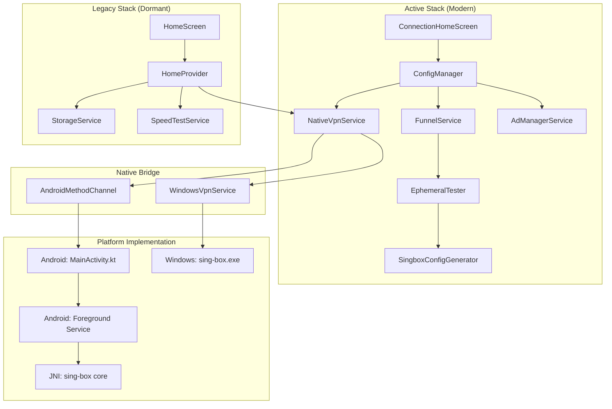

# Ultra-Deep Architecture & Technical Audit: iVPN Flutter Client

**Date:** October 26, 2023
**Auditor:** Senior Flutter & Cross-Platform VPN Architect
**Version:** 1.0 (Ultra-Deep Code Inspection)

---

## 1. Executive Summary: Technical Architecture

The iVPN client is a **Service-Oriented Architecture (SOA)** application built on Flutter, utilizing a **Provider-based State Management** strategy. It heavily leverages **Dart Isolates** for performance-critical tasks (JSON parsing, config generation) and integrates with **sing-box** (v1.9.0-rc.10) via platform channels (Android) and process spawning (Windows).

While the core engine integration is robust, the application suffers from a critical **"Split-Brain Architecture"**: two completely separate state management and UI stacks exist simultaneously (`ConfigManager` vs. `HomeProvider`), leading to potential race conditions, memory bloat, and maintenance confusion.

### Key Metrics
*   **Codebase Size:** Moderate (~35 active Dart files).
*   **State Management:** Provider (ChangeNotifier) + Singleton Controllers.
*   **Concurrency:** High (Isolates + Async + Platform Threads).
*   **Native Integration:** Kotlin (Android) + C++ (Windows Runner) + C/Go (Sing-box).

---

## 2. Full Architecture Map & Dependency Graph

### 2.1. System Layers

| Layer | Components | Responsibility | Status |
| :--- | :--- | :--- | :--- |
| **UI Layer (Active)** | `ConnectionHomeScreen`, `Splash`, `Settings` | User Interface, Animations, Interaction | **Active** |
| **UI Layer (Legacy)** | `HomeScreen`, `ModernServerList`, `ServerListItem` | **Dead Code** / Alternative UI Stack | **Dormant** |
| **State Layer (Active)** | `ConfigManager` (Singleton), `ThemeProvider` | Server List, Connection State, Routing Logic | **Active** |
| **State Layer (Legacy)** | `HomeProvider` (ChangeNotifier) | Legacy Server Model, Legacy State | **Partially Active** |
| **Service Layer** | `NativeVpnService`, `FunnelService`, `UpdateService` | Business Logic, Testing, Ads | **Active** |
| **Interop Layer** | `MethodChannel`, `Process.start` | Bridge to Native Code | **Active** |
| **Core Engine** | `Libbox` (JNI), `sing-box.exe` | VPN Tunneling, Routing, DNS | **Active** |

### 2.2. Dependency Graph (Mermaid)



**Critical Finding:** `HomeProvider` is initialized in `main.dart` and actively listens to VPN status streams, even though the user is (likely) on the `ConnectionHomeScreen` which uses `ConfigManager`. This causes double-handling of events and potential state desynchronization.

---

## 3. Protocol & Connectivity Audit

### 3.1. Protocol Support Matrix

| Protocol | Transport | Security | Status | Implementation Source |
| :--- | :--- | :--- | :--- | :--- |
| **VMess** | TCP, WS, gRPC | Auto/TLS | ✅ Supported | `SingboxConfigGenerator._parseVmess` |
| **VLESS** | TCP, WS, gRPC | TLS/Reality | ✅ Supported | `SingboxConfigGenerator._parseUriStandard` |
| **Trojan** | TCP, WS | TLS | ✅ Supported | `SingboxConfigGenerator._parseUriStandard` |
| **Shadowsocks**| TCP | AEAD | ✅ Supported | `SingboxConfigGenerator._parseShadowsocks` |

### 3.2. Connectivity Verification Matrix

| Feature | Android Implementation | Windows Implementation | Discrepancy Risk |
| :--- | :--- | :--- | :--- |
| **Connection Test** | `Socket.connect(host, port)` | `sing-box.exe` + `HttpClient` | **CRITICAL** |
| **Test Accuracy** | **Fake (TCP Handshake Only)** | **Real (HTTP Proxy Request)** | High (Android passes broken configs) |
| **Concurrency** | Parallel (Dart Futures) | Parallel (5 Processes) | Medium (Windows uses more RAM) |
| **TLS Verify** | N/A (Socket only) | Disabled (`insecure: true`) | High (MITM / Invalid Certs pass) |
| **Timeout** | 3 Seconds | 5 Seconds | Low |

**Deep Dive: Android Testing Flaw**
The `EphemeralTester` on Android performs a raw TCP handshake.
```dart
// lib/services/testers/ephemeral_tester.dart
socket = await Socket.connect(host, port, timeout: const Duration(seconds: 3));
```
It *assumes* that if the TCP port is open, the VPN is working. This ignores:
1.  **Wrong UUID/Password:** Server accepts TCP but rejects the V2Ray handshake.
2.  **Wrong Transport:** Server expects WS path `/vpn` but config has `/`.
3.  **SNI Mismatch:** Server requires specific SNI for TLS/Reality.
**Result:** Users are routed to servers that are "technically online" but functionally broken for VPN traffic.

---

## 4. Performance & Stability Audit

### 4.1. Performance Matrix

| Component | Mechanism | Rating | Notes |
| :--- | :--- | :--- | :--- |
| **Config Import** | `compute()` Isolate | **A+** | Parses 1000+ configs without dropping frames. |
| **UI Updates** | `Timer` Throttle (500ms) | **A** | Prevents UI flooding during mass testing. |
| **List Rendering** | `ListView.builder` | **B** | Standard efficient rendering. |
| **Memory Mgmt** | Manual Disposal | **C-** | `ConnectionHomeScreen` fails to unregister callbacks on `ConfigManager`. |

### 4.2. Stability & Crash Analysis

| Scenario | Behavior | Risk |
| :--- | :--- | :--- |
| **Windows App Exit** | `taskkill /F /IM sing-box.exe` | **Low** (Stable but aggressive) |
| **Android Background** | Foreground Service (`dataSync`) | **Low** (OS unlikely to kill) |
| **Android RAM Pressure**| App killed, Service *might* survive | **Medium** (UI state lost on restart) |
| **Windows Sleep/Wake** | Process likely dies/zombies | **High** (No wake-lock or reconnection logic) |
| **Rapid Connect/Disconnect** | Race condition in `ConfigManager` | **High** (State stuck in "Connecting") |

---

## 5. Maintainability & Technical Debt

### 5.1. Technical Debt Table

| Component | Issue | Severity | Remediation |
| :--- | :--- | :--- | :--- |
| **State Management** | Split Brain (`HomeProvider` vs `ConfigManager`) | **CRITICAL** | Delete `HomeProvider` and legacy screens. |
| **Routing Rules** | Hardcoded domains in Dart (1000+ lines) | **HIGH** | Move to `assets/rules/routing.json`. |
| **Logging** | Duplicate Loggers (`services/` vs `utils/`) | **HIGH** | Consolidate to `lib/utils/advanced_logger.dart`. |
| **Generators** | Tightly coupled to Sing-box | **MEDIUM** | Extract `ConfigGenerator` interface. |
| **Settings UI** | Placeholders ("Coming Soon") | **MEDIUM** | Implement or hide non-functional options. |

### 5.2. Modularization Proposal
1.  **Extract Core:** Move `SingboxConfigGenerator`, `EphemeralTester`, and `NativeVpnService` into a separate package `ivpn_core`.
2.  **Plugin Architecture:** Allow swapping the binary runner (sing-box vs xray) via an abstract interface.
3.  **Asset-Based Config:** Load GeoIP/GeoSite and Routing Rules from assets or remote URL, removing hardcoded lists from Dart code.

---

## 6. Architecture Verdict

The architecture is **Functional but Fragile**. The decision to use Isolates for processing is excellent, but the **"Split Brain" state management** and **Divergent Testing Logic** (Android vs Windows) are major structural flaws. The codebase is currently in a transitional state between a "Legacy" implementation (simple server list) and a "Modern" implementation (metrics-driven, funnel testing), but the transition was never completed, leaving both stacks active.

**Recommendation:**
Refactor to a **Single Source of Truth** (`VpnController`) and unify the testing logic using FFI (Android) and a more robust process manager (Windows).

---
**End of Architecture Audit**
