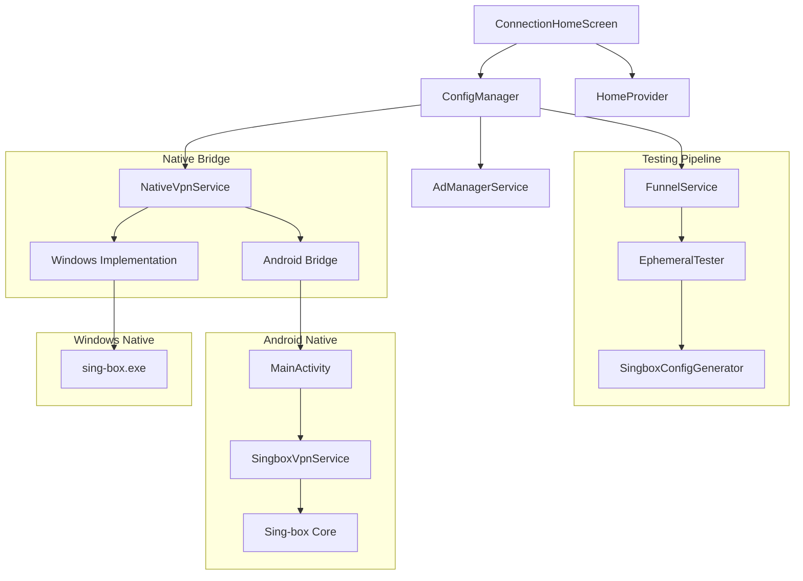

# Commercial Launch Readiness Audit: iVPN Client

**Date:** October 26, 2023
**Target:** Production-Grade Flutter VPN Client (Android + Windows)
**Auditor:** Senior Flutter Architect

---

## 1. Executive Summary

**Verdict: NOT READY FOR COMMERCIAL LAUNCH**

The iVPN client is a technically impressive prototype with advanced features like parallel testing, smart routing, and seamless ad integration. However, it suffers from **Critical Security Vulnerabilities** and **Fundamental Reliability Flaws** that would cause immediate reputational damage and potential legal liability if released commercially today.

**Critical Blockers (Must Fix Before Launch):**
1.  **Security Data Leak (Windows):** The application logs full private configurations (keys, passwords, UUIDs) to the application log in cleartext.
2.  **False Positive Testing (Android):** The "Deep Testing" feature is deceptive. It verifies TCP connectivity to the server port but **does not** verify the VPN protocol handshake. Users will be connected to broken servers.
3.  **Plaintext Credential Storage:** Sensitive VPN configurations are stored in unencrypted `SharedPreferences`, accessible to anyone with root access or via backup extraction.
4.  **Logging Architecture Failure:** Logs on Windows are not being written to disk due to a "Split Brain" logger initialization, making post-launch support impossible.

**Key Strengths:**
*   **Performance:** Excellent use of Dart Isolates for heavy lifting, ensuring a 60fps UI.
*   **Feature Set:** Rich feature set including "Smart Funnel" testing, ad-reward system, and split tunneling (via domain rules).
*   **Windows Stability:** Robust process management ensures no zombie processes remain after disconnect.

---

## 2. Architecture Overview & Dependency Graph

### 2.1. System Architecture
The app follows a Service-Oriented Architecture (SOA) with a Provider-based State Management layer.

*   **UI Layer:** `ConnectionHomeScreen` (Main), `Splash`, `Settings`.
*   **State Layer:** `ConfigManager` (Singleton Controller), `HomeProvider` (Legacy/Deprecated).
*   **Service Layer:** `NativeVpnService`, `FunnelService`, `AdManagerService`, `UpdateService`.
*   **Core Engine:** `sing-box` (v1.9.0-rc.10 estimated).

### 2.2. Dependency Graph

### 2.3. Architectural Risks
*   **Split Brain State:** `ConfigManager` and `HomeProvider` both manage server lists and connection states. This duplication leads to race conditions where the UI might show "Connected" while the underlying provider is "Disconnected".
*   **Hardcoded Routing:** `SingboxConfigGenerator` contains thousands of lines of hardcoded domain rules. This makes updates impossible without a full app release.

---

## 3. Security & Privacy Assessment

| Category | Risk Level | Finding | Impact |
| :--- | :--- | :--- | :--- |
| **Data Leak** | **CRITICAL** | `WindowsVpnService` logs full JSON config (including private keys) to `AdvancedLogger`. | **Credential Theft:** Malicious actors or malware can read logs to steal premium VPN access. |
| **Storage** | **HIGH** | `StorageService` saves configs in `SharedPreferences` (XML) as plaintext. | **Privacy Breach:** Rooted devices or backups expose all user credentials. |
| **Network** | **HIGH** | Android Manifest enables `usesCleartextTraffic="true"`. | **MITM Attack:** Allows unencrypted HTTP traffic, bypassing VPN protections if misconfigured. |
| **Testing** | **HIGH** | Connection tests use `insecure: true` (Skip TLS Verify). | **False Security:** A server with a hijacked/invalid certificate will pass testing, misleading the user. |
| **Updates** | **MEDIUM** | `UpdateService` hits GitHub API directly. | **Privacy Leak:** User IP addresses are exposed to GitHub during update checks (pre-VPN). |

---

## 4. Performance & Stability Audit

| Component | Status | Analysis |
| :--- | :--- | :--- |
| **Isolates** | **Excellent** | `ConfigManager` offloads JSON parsing and Regex to background isolates using `compute()`. UI remains responsive even when importing 1000+ configs. |
| **Windows Process** | **Stable** | Uses `taskkill /F /IM sing-box.exe` to clean up. Aggressive but effective at preventing zombie processes. |
| **Android Service** | **Good** | Uses Foreground Service (`dataSync` type). Survives backgrounding. |
| **Memory** | **Warning** | `ConnectionHomeScreen` registers listeners on `ConfigManager` but fails to unregister them in `dispose()`, causing a memory leak on every screen rebuild. |
| **Throttling** | **Good** | `ConfigManager` implements a 500ms throttle for UI updates, preventing flood of redraws during mass testing. |

---

## 5. Protocol & Connectivity Verification

### 5.1. Supported Protocols
*   **VMess** (TCP, WS, gRPC)
*   **VLESS** (TCP, WS, gRPC, Reality)
*   **Trojan**
*   **Shadowsocks**

### 5.2. Testing Logic Divergence (The "Deep Testing" Flaw)
*   **Windows:** Spawns a real `sing-box` instance. Performs actual HTTP requests through the proxy. **Result: Accurate.**
*   **Android:** Performs a raw `Socket.connect(host, port)`. **Result: Fake.**
    *   *Scenario:* A VMess server is online (TCP Open) but the user has the wrong UUID.
    *   *Windows:* Fails HTTP test (Correct).
    *   *Android:* Passes TCP test (Incorrect). User connects and gets "No Internet".

### 5.3. IPv6 Strategy
*   **Status:** Disabled.
*   **Config:** `strategy: "ipv4_only"` is hardcoded in `SingboxConfigGenerator`.
*   **Impact:** Users on IPv6-only networks (increasingly common in mobile) may face connectivity issues or leaks if not handled by the OS correctly.

---

## 6. Observability & Telemetry Readiness

*   **Logging:** **Broken on Windows.** The app initializes `AdvancedLogger` (Stub) in `main.dart`, but `WindowsVpnService` imports `AdvancedLogger` (Real). Logs are likely lost or only printed to `stdout` (Console), not disk.
*   **Crash Reporting:** **Local Only.** `FlutterError.onError` catches crashes but only logs them locally. No integration with Sentry, Firebase Crashlytics, or similar.
*   **Telemetry:** **None.** No analytics to track successful connection rates, average latency, or feature usage. Blind launch.

---

## 7. Maintainability & Modularization

*   **Hardcoded Rules:** `SingboxConfigGenerator` embeds a massive list of ad-blocking and direct domains.
    *   *Recommendation:* Move to `assets/rules/routing.json` and load dynamically.
*   **Generator Coupling:** The config generator is tightly coupled to `Singbox`.
    *   *Recommendation:* Create an abstract `ConfigGenerator` class to allow swapping the core (e.g., to Xray) in the future.
*   **Naming Conventions:** Inconsistent. Mixed use of `Server` (Legacy) and `VpnConfigWithMetrics` (Modern).

---

## 8. Prioritized Action Plan

### Phase 1: Critical Fixes (Immediate - Do Not Launch Without These)
1.  **Security:** Remove the log line in `WindowsVpnService` that dumps the full config.
2.  **Android:** Rewrite `EphemeralTester` for Android. It MUST use `SingboxVpnService.measurePing` (which uses Libbox) instead of `Socket.connect`.
3.  **Storage:** Implement `flutter_secure_storage` for credentials.
4.  **Logging:** Fix the import paths for `AdvancedLogger` to ensure logs are actually written to disk.

### Phase 2: High Priority (Pre-Launch)
1.  **State:** Deprecate `HomeProvider`. Move all logic to `ConfigManager` to eliminate "Split Brain".
2.  **Crash Reporting:** Integrate Sentry or Firebase Crashlytics. You cannot debug production crashes without this.
3.  **IPv6:** Change strategy to `prefer_ipv4` instead of `ipv4_only` to support modern networks.

### Phase 3: Post-Launch Improvements
1.  **Remote Rules:** Fetch routing rules (geoip/geosite) from a remote URL on startup instead of hardcoding.
2.  **Telemetry:** Add anonymous usage metrics (connection success rate, error types).
3.  **Windows Optimization:** Use the `URLTest` feature of Sing-box instead of spawning 5 concurrent processes for testing.

---
**End of Report**
